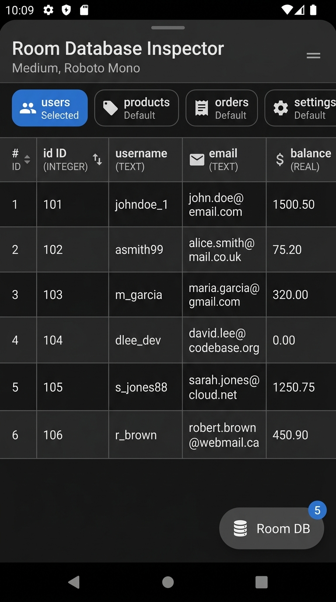
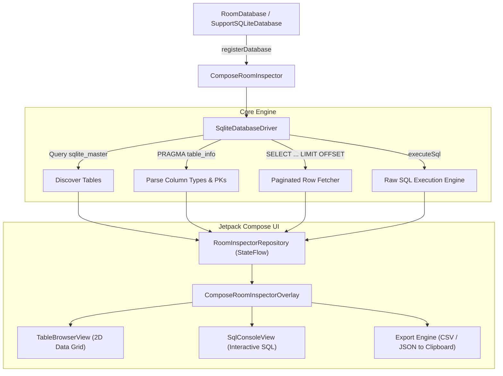

# 🗄️ compose-room-inspector

[](LICENSE)
[](https://kotlinlang.org)
[](https://developer.android.com)

> **In-App SQLite & Room Database Browser and SQL Query Editor with Jetpack Compose Overlay for Android.**

`compose-room-inspector` is a lightweight developer tool that enables mobile developers and QA engineers to **browse tables, inspect live schemas, execute raw SQL queries, and export database records** directly on-device without tethering to USB cables or desktop inspection tools.

<p align="center">
  
</p>

---

## ✨ Features

- 🔍 **Automatic Table & Schema Discovery**: Discovers all user tables, primary keys (`🔑`), data types, and row counts via `PRAGMA table_info`.
- 📊 **2D Scrollable Data Grid**: Sticky column headers, row numbering, and interactive horizontal/vertical scrolling.
- ⚡ **Interactive SQL Console**: Execute arbitrary raw SQL (`SELECT`, `INSERT`, `UPDATE`, `DELETE`, `PRAGMA`) with real-time execution timing (`⚡ 12 ms`) and autocomplete snippets.
- 🔎 **Instant Row Filtering & Pagination**: Search records across all columns in real-time with configurable page sizing.
- 📋 **1-Tap Export**: Export table rows directly as CSV or formatted JSON to the clipboard.
- 📱 **Floating Jetpack Compose Overlay**: Non-intrusive floating badge and expandable Material 3 bottom-sheet.

---

## 🏛️ Architecture & How It Works



### 1. Zero-Friction Database Binding
Register your Room Database or SQLite instance during app initialization:
```kotlin
ComposeRoomInspector.registerRoomDatabase("AppDatabase", roomDatabase)
```
* Extracts the underlying `SupportSQLiteDatabase` via `roomDatabase.openHelper.writableDatabase`.
* Supports registering multiple databases simultaneously (e.g. User DB, Cache DB, Analytics DB).

### 2. Automated Schema & Table Discovery
`SqliteDatabaseDriver` inspects SQLite system catalogs on-device:
* Queries `sqlite_master` to discover all user-created tables while omitting internal system tables (`sqlite_%`, `room_master_table`, `android_metadata`).
* Runs `PRAGMA table_info(tableName)` to extract column names, data types (`INTEGER`, `TEXT`, `REAL`), nullability, and primary key flags (`🔑`).

### 3. Paginated 2D Data Grid & Multi-Column Search
* Queries rows lazily with pagination (`SELECT * FROM table LIMIT 25 OFFSET 0`) to support large databases containing 100,000+ records without memory overhead.
* The search bar generates dynamic multi-column `LIKE` filters across all fields in real-time.
* `TableBrowserView` renders a high-performance 2D scrollable data grid with sticky column headers.

### 4. Interactive SQL Runner with Duration Badging
* Execute raw queries (`SELECT`, `INSERT`, `UPDATE`, `DELETE`, `PRAGMA`) directly in the **SQL Console** tab.
* Times execution in milliseconds (`⚡ 12 ms`) and displays affected row counts.
* DML/DDL statements (`INSERT`, `UPDATE`, `DELETE`) automatically trigger reactive UI refreshes in the **Table Browser** tab.

### 5. In-Memory Export Engine
* **Export as CSV**: Generates standard RFC-4180 comma-separated values.
* **Export as JSON**: Generates formatted JSON arrays of objects.
* 1-tap copy directly into Android's system clipboard for sharing in Slack, emails, or bug reports.

---

## 📦 Installation

Add JitPack to your `settings.gradle.kts`:

```kotlin
repositories {
    maven { url = uri("https://jitpack.io") }
}
```

Add the dependency to your app's `build.gradle.kts`:

```kotlin
dependencies {
    debugImplementation("com.github.zakayothuku:compose-room-inspector:v1.0.0")
}
```

---

## 🚀 Quickstart

### 1. Register Database in Application / Activity

```kotlin
// Option A: With AndroidX Room Database
ComposeRoomInspector.registerRoomDatabase("AppDatabase", roomDatabase)

// Option B: With SupportSQLiteDatabase
ComposeRoomInspector.registerDatabase("MainDb", sqliteDatabase)
```

### 2. Attach Floating Compose UI Overlay

Place `ComposeRoomInspectorOverlay()` inside your top-level `Surface` or `Scaffold`:

```kotlin
@Composable
fun AppContent() {
    Box(modifier = Modifier.fillMaxSize()) {
        YourMainNavigation()

        // Attach floating Room DB inspector overlay
        ComposeRoomInspectorOverlay()
    }
}
```

---

## 🛠️ Advanced Usage & Programmatic Control

```kotlin
// Register multiple databases
ComposeRoomInspector.registerDatabase("UsersDb", usersSqliteDb)
ComposeRoomInspector.registerDatabase("CacheDb", cacheSqliteDb)

// Programmatically execute SQL or refresh
RoomInspectorRepository.selectDatabase("UsersDb")
RoomInspectorRepository.selectTable("users")
RoomInspectorRepository.executeSql("UPDATE users SET status = 'ACTIVE' WHERE role = 'ADMIN'")
RoomInspectorRepository.refreshCurrentTable()

// Export table data programmatically
val csvString = RoomInspectorRepository.exportCurrentTableAsCsv()
val jsonString = RoomInspectorRepository.exportCurrentTableAsJson()
```

---

## 🧪 Testing

Run library unit tests:

```bash
./gradlew :library:test
```

Build sample application:

```bash
./gradlew :app:assembleDebug
```

---

## 📄 License & Author

Developed & maintained by **Zakayo Thuku** ([@zakayothuku](https://github.com/zakayothuku)).

```
MIT License - Copyright (c) 2026 Zakayo Thuku
```
